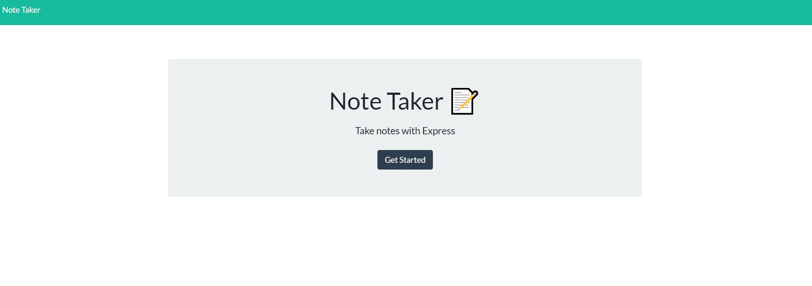
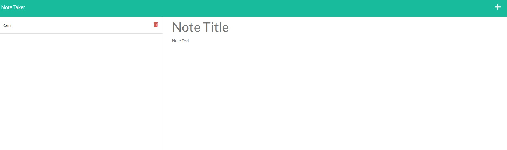

# note-taker

## Table of Contents

- [Description](#Description)
- [Links&Screenshot](#Links)
- [License](#license)
- [Questions](#questions)
## Description

- This application was created to allow small business owners to record their notes and delete them on the go. 
- This project demonstrates use of express.js and node.js. 
- In the project I used local database to store data.
- This project also built using JQuery, bootstrap and google fonts to build HTML page.
- Files organised in a good structured way for easy access.

## Links

[Deployment-Link](https://nameless-falls-05709.herokuapp.com/)

## License 

The project is un MIT license

## Questions 

If you have any questions about this projects, please contact me directly at ramielsayed123@outlook.com. You can view more projects of mine at https://github.com/RamiElsayed